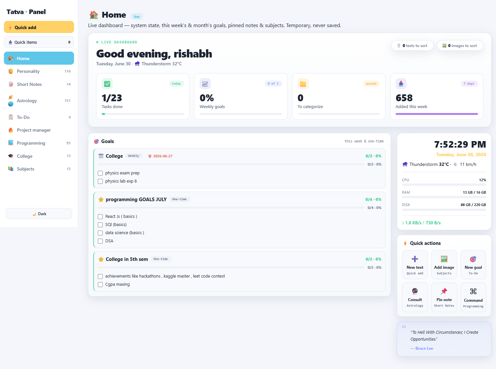
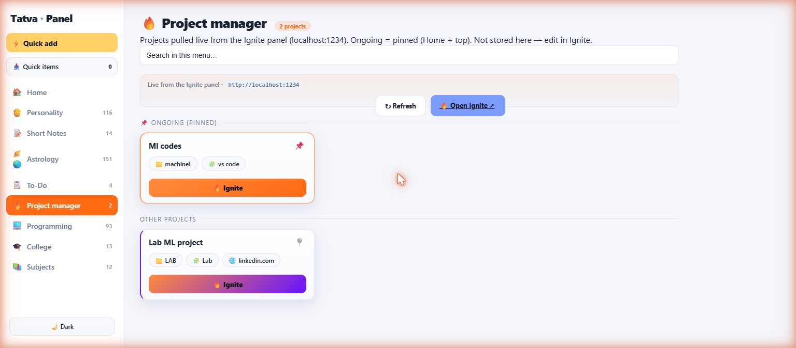

# Tatva · Panel

A personal, **local-first knowledge & dashboard system** — a single self-hosted web app that keeps notes, images, links, study material, goals, and live system stats in one place. No accounts, no cloud, no build step, no dependencies. Just Node's standard library and vanilla JS.

> Runs entirely on your machine at `http://localhost:4321`. Your data lives in one portable folder.

---

## Screenshots

### Home — a live dashboard
System state (CPU / RAM / disk / network), weather, this week's & one-time goals with progress bars, quick actions, and an hourly quote.



### Project manager — projects pulled live from the Ignite panel
A dedicated menu that fetches projects from a sibling app ([Ignite](#project-manager--ignite-integration), `localhost:1234`) and shows them with their own actions — open folder, VS Code, links, or **🔥 Ignite** them all at once. Ongoing projects are pinned to the top and to Home.



---

## Why it exists

One place to dump and organize everything — study notes, screenshots, useful links, astrology/personality material, to-dos — browsable as colorful **carousels**, with strict local backups so nothing is ever lost. It replaced a pile of standalone HTML dashboards.

## Features

- **Carousel pages** — every section renders as a scrollable carousel of images, text notes, or links. Per-carousel color, header message, "important" (pin to top of page), "show on Home", manual reorder, rename, export, delete.
- **Home** — live dashboard: clock, weather (open-meteo), CPU/RAM/disk/network, task & goal progress, quick actions, pinned notes, home-marked carousels, an hourly rotating quote, and pinned projects.
- **Quick add (inbox)** — drag-and-drop any image, text file, link, or snippet anywhere on the page into a Quick-items inbox, then categorize it into a real page later.
- **To-Do** — weekly / monthly / one-time goals, each a checklist with an attached progress bar; weekly goals snap to Mon→Sun; overdue goals surface in a "Missed" section. Star a goal to show it on Home.
- **Links** — kept in their own `LINKS` carousel per page, optionally grouped by category (`LINKS - {Category}`).
- **Image & text import** — upload single files or a whole folder; text files render as readable cards.
- **Export** — write any page or single carousel to `Desktop/Tatva Exports/` as a per-carousel folder tree (images copied, notes as `.txt`, links as `links.txt`).
- **Project manager** — see [below](#project-manager--ignite-integration).
- **Strict backups** — every save backs up the DB first (last 80 kept); deleted images are moved to a backup folder, never hard-erased.
- **Dark / light theme.**

## Project manager · Ignite integration

The **Project manager** menu doesn't store anything itself — it pulls projects **live** from a separate app, the *Ignite panel* (`http://localhost:1234`), through a server-side proxy (so there's no CORS and it works whenever Ignite is running).

- **Ongoing = pinned** → shown at the top of the page and on the Home dashboard.
- Each project card carries its own actions (📁 folder · 🧩 VS Code · 🌐 link · 🖥️ app · ⌨️ command). Web links open directly; the rest run through Ignite's local launcher.
- **🔥 Ignite** fires all of a project's actions at once; **pin/unpin** writes back to Ignite.
- If Ignite isn't running, the page shows an "Open Ignite ↗" fallback.

## Running it

```bash
cd panel
node server.js          # serves http://localhost:4321
```

Or launch `panel/start.bat` (starts the server minimized if it isn't already running, then opens the browser).

There are **no dependencies** to install. Requires Node 18+ (uses the built-in `fetch`).

Sanity checks (there are no tests/linters):

```bash
node -c panel/server.js
node -c panel/public/app.js
```

> **Restart rule:** editing `server.js` needs a restart (Node doesn't hot-reload). Editing anything in `public/` only needs a hard refresh (Ctrl+Shift+R).

## Architecture

- **`panel/server.js`** — a zero-dependency Node `http` server. Serves the SPA and a small REST API: `GET|POST /api/db`, `GET /api/sysinfo`, `POST /api/export`, image upload/rename/delete, the `/api/ignite-*` proxy to the Ignite panel, and `GET /images/*`.
- **`panel/public/app.js`** — the entire single-page app in one vanilla-JS file (no framework). The client loads the whole DB into memory; every mutation re-POSTs the full DB (debounced), and the server backs up then overwrites.
- **`panel/public/index.html` / `style.css`** — DOM scaffold (sidebar + main + modals + lightbox) and styling, dark/light via `data-theme`.

### Data model

`store/db.json` = `{ settings, categories[], items[] }`. An **item** is `{ id, category, section, title, body, created, updated }` plus optional fields per renderer (links: `link/message/reason`; images: `kind/file/important/part`; goals: `periodStart/periodEnd`). **Sections are just strings** — a "carousel" is every item sharing a `section`. Per-carousel metadata (color, importance, home flag, order) lives in `settings.carousels`.

### The portable store

Everything persistent lives in **`panel/store/`** (`db.json` + `seed.json` + `backups/` + `images/`). Copying that one folder transfers the whole system.

> This repository contains the **application code only** — the personal `store/` data, to-do markdown, and one-off migration scripts are intentionally not published.

## Repository layout

```
panel/
  server.js            # the Node server + REST API
  public/              # the SPA (index.html, app.js, style.css)
  data/
    add-projects-menu.js   # adds the Project manager menu
  start.bat
docs/screenshots/      # images used in this README
plan_tatva/            # design notes (tech stack, structure, flowcharts)
.claude/               # page/carousel/export design specs
CLAUDE.md              # guidance for working in this repo
```

## License

Personal project — all rights reserved by the author.
