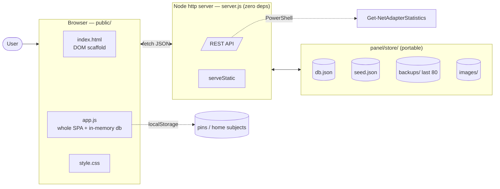
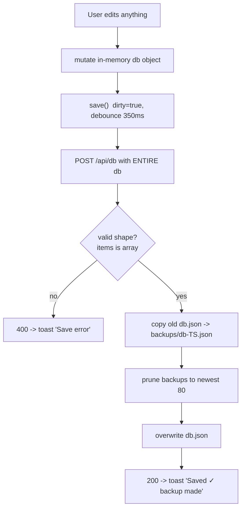
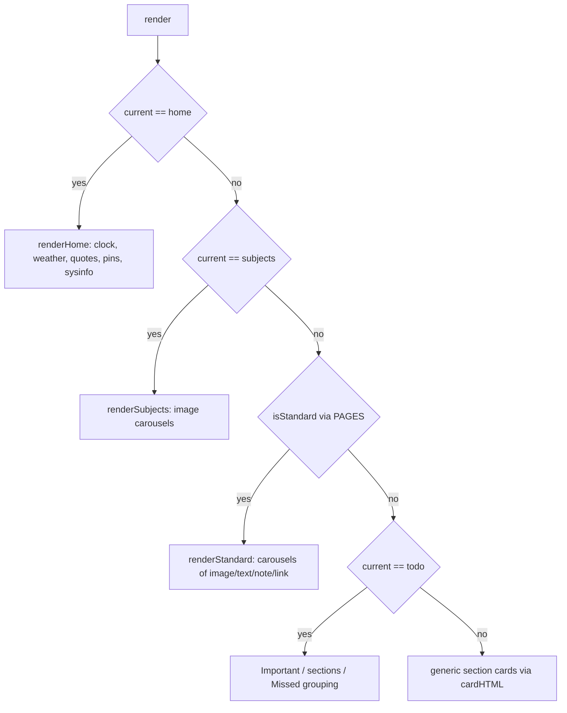
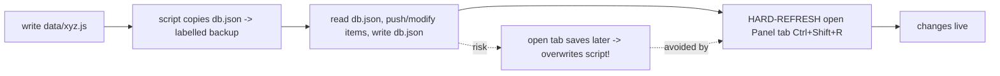
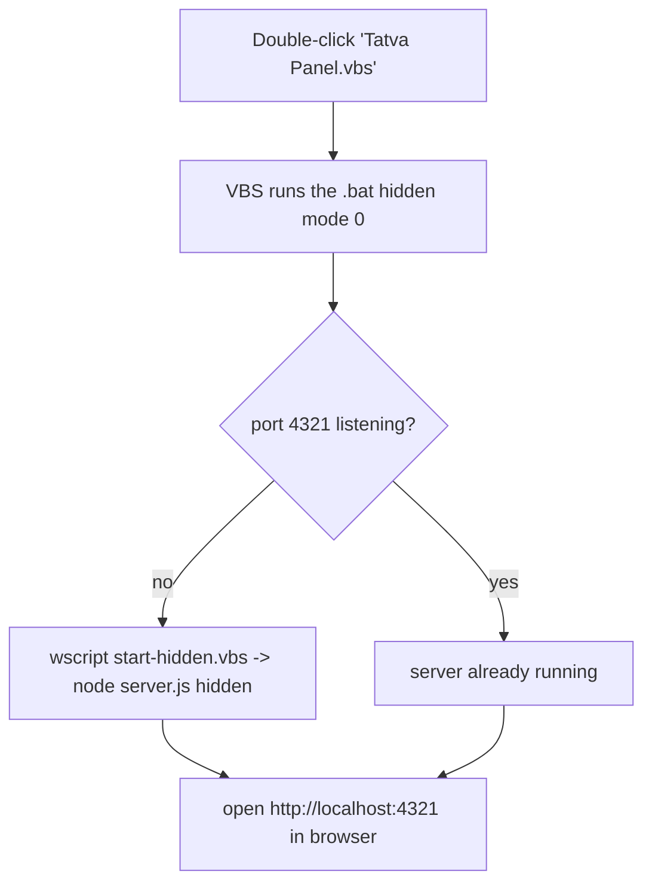

# 04 — Flowcharts

Mermaid diagrams (render in Obsidian, GitHub, VS Code Mermaid preview).
ASCII fallbacks included where useful.

## 1. High-level architecture



## 2. App boot / load

```mermaid
sequenceDiagram
    participant B as Browser (app.js)
    participant S as server.js
    participant D as store/db.json
    B->>S: GET /api/db
    S->>D: readFileSync
    D-->>S: JSON
    S-->>B: whole DB
    B->>B: db = json; migrate legacy fields
    B->>B: applyTheme(); pick current category
    B->>B: render()  // dispatch by category
```

## 3. The save loop (every edit re-POSTs the whole DB)



ASCII view:

```
edit -> db.{change} -> save() --350ms--> POST /api/db (full db)
                                             |
                       server: backup old db.json -> backups/
                               prune > 80
                               write new db.json
                                             |
                                       toast: Saved ✓
```

## 4. Request routing in server.js (order matters — prefix matching)

```mermaid
flowchart TD
    Req[incoming request] --> Q1{startsWith /api/db}
    Q1 -- yes --> DB[GET return db / POST backup+write]
    Q1 -- no --> Q2{/api/export AND NOT /api/export-subjects}
    Q2 -- yes --> Exp[write Desktop/Tatva Exports tree]
    Q2 -- no --> Q3{/api/sysinfo}
    Q3 -- yes --> Sys[cpu/ram/disk/net]
    Q3 -- no --> Q4{/api/upload|rename|delete-image}
    Q4 -- yes --> Img[mutate store/images]
    Q4 -- no --> Q5{/api/export-subjects}
    Q5 -- yes --> ExpS[legacy images export]
    Q5 -- no --> Q6{/images/*}
    Q6 -- yes --> Serve[serve file from images/]
    Q6 -- no --> StaticF[serveStatic from public/]
```

> ⚠️ `/api/export-subjects` lives **after** the `/api/export` guard precisely because
> `startsWith('/api/export')` would otherwise swallow it.

## 5. render() dispatch



## 6. Data-script workflow (the "admin UI")



## 7. Launch (zero-window double-click)


